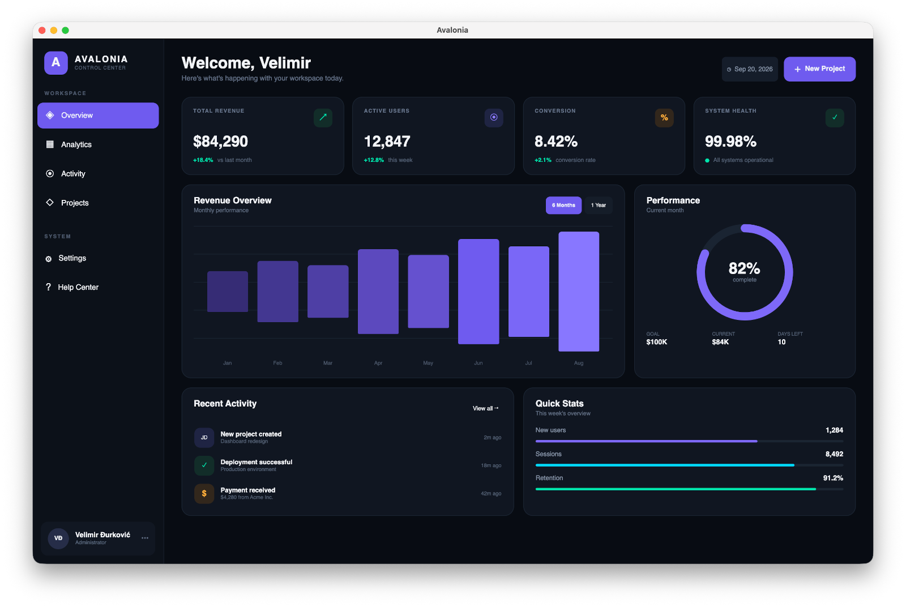

# Avalonia Dashboard

A modern desktop dashboard application built with Avalonia UI and .NET.

The project provides a clean and extensible foundation for building cross-platform desktop applications with a dashboard-style main view.

## Features

- Cross-platform desktop application
- Modern and clean dashboard UI
- Component-based architecture
- Dashboard overview and navigation
- Built with Avalonia UI and .NET
- Easy to extend with additional views and features

## Technologies

- .NET
- Avalonia UI
- C#
- XAML
- MVVM

## Screenshots



## Getting Started

### Prerequisites

Make sure you have the following installed:

- .NET SDK
- An IDE such as Visual Studio, JetBrains Rider, or VS Code

### Clone the repository

```bash
git clone https://github.com/djvelimir/demo-dotnet-avalonia.git
cd demo-dotnet-avalonia
```

### Build the project

```bash
dotnet restore
dotnet build
```

### Run the application

```bash
dotnet run --project AvaloniaApp/AvaloniaApp.csproj
```

## Architecture

The application follows the MVVM (Model-View-ViewModel) pattern.

```
View
│
▼
ViewModel
│
▼
Model / Services
```

This separation makes the application easier to maintain, test, and extend.

## License

This project is licensed under the MIT License. See the LICENSE file for more information.

## Support

If you find this project useful, consider giving it a ⭐ on GitHub.
